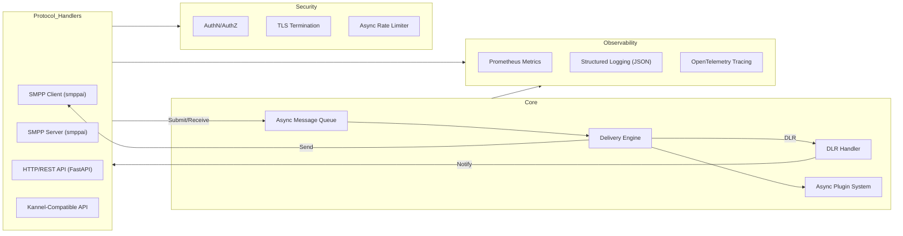

# Solution Design: Next-Generation Async Python SMS Gateway

---

## 1. Architecture Overview

**High-Level Diagram (Mermaid):**

**Key Points:**
- All protocol handlers (SMPP, HTTP/REST, Kannel) are async and feed into a central async message queue.
- Delivery engine manages message dispatch, retries, and DLRs.
- Observability and security are cross-cutting concerns.
- Extensibility via plugins and event hooks.

---

## 2. Component Design

### **Protocol Handlers**
- **SMPP (smppai):**  
  - Use [smppai](https://github.com/codcod/smppai) for async SMPP v3.4 client/server.
  - Handles ESME and SMSC connections, message submission, and DLRs.
- **HTTP/REST API:**  
  - Built with FastAPI (async), exposes endpoints for message submission, status, and health.
- **Kannel-Compatible API:**  
  - HTTP endpoints and config mapping for Kannel migration.

### **Core Messaging**
- **Async Message Queue:**  
  - In-memory (asyncio.Queue) or external (e.g., Redis, NATS) for decoupling protocol ingress from delivery.
- **Delivery Engine:**  
  - Async workers pull from queue, handle routing, retries (configurable backoff), and delivery.
- **DLR Handler:**  
  - Correlates delivery receipts with original messages, notifies clients via original protocol.

### **Extensibility**
- **Plugin System:**  
  - Async hooks for routing, filtering, transformation (e.g., via pluggy or custom).
- **Webhooks/Event Hooks:**  
  - Async event notifications for status, failures, etc.

### **Observability**
- **Metrics:**  
  - Prometheus exporter (e.g., prometheus_client).
- **Logging:**  
  - Async, structured JSON logs (e.g., structlog, loguru).
- **Tracing:**  
  - OpenTelemetry integration for distributed tracing.

### **Security**
- **TLS:**  
  - TLS for all endpoints (SMPP, HTTP/REST).
- **Authentication/Authorization:**  
  - API keys, OAuth2 (FastAPI), SMPP credentials.
- **Rate Limiting:**  
  - Async per-user/IP (e.g., slowapi, aioredis).

---

## 3. Technology Choices

| Area                | Library/Tool         | Rationale                                      |
|---------------------|---------------------|------------------------------------------------|
| SMPP                | smppai              | Modern, async SMPP client/server                |
| HTTP/REST API       | FastAPI             | Async, OpenAPI docs, high performance           |
| Message Queue       | asyncio.Queue/Redis | Async, scalable, decouples components           |
| Metrics             | prometheus_client   | Standard for metrics export                     |
| Logging             | structlog/loguru    | Structured, async-friendly                      |
| Tracing             | OpenTelemetry SDK   | Industry standard for distributed tracing       |
| Auth                | FastAPI, OAuthlib   | Secure, extensible, async support               |
| Rate Limiting       | slowapi/aioredis    | Async, scalable                                 |
| Plugin System       | pluggy/custom       | Proven plugin architecture                      |
| Containerization    | Docker, Kubernetes  | Cloud-native, scalable                          |
| Config Management   | pydantic/env files  | Type-safe, reloadable configs                   |

---

## 4. Data Flow & Sequence

### **SMS Submission (Async Sequence)**

1. **Client submits SMS** via SMPP, HTTP/REST, or Kannel API.
2. **Protocol handler** validates/authenticates request.
3. **Message is enqueued** in async message queue.
4. **Delivery engine** picks up message, applies plugins (routing/filtering).
5. **Message is sent** to SMSC (via smppai client).
6. **DLR received** from SMSC, handled by DLR handler.
7. **DLR relayed** to original client via protocol handler.

### **Retry & Error Handling**
- Failed deliveries are retried with configurable backoff.
- Max retries exceeded → failure logged, client notified.
- All operations are non-blocking; errors are logged and surfaced via API.

---

## 5. Security & Compliance

- **TLS Everywhere:**  
  - All endpoints require TLS; certificates configurable and reloadable.
- **Authentication & Authorization:**  
  - API: OAuth2, API keys (FastAPI dependencies).
  - SMPP: Username/password per ESME.
  - Role-based access for admin endpoints.
- **Rate Limiting:**  
  - Async, per-user/IP, configurable.
- **Compliance:**  
  - Logging of access attempts, audit trails.
  - Data minimization and retention policies.
  - GDPR/data protection: configurable PII handling, encrypted storage if needed.

---

## 6. Extensibility & Integration

- **Plugin Architecture:**  
  - Async plugin hooks for message routing, filtering, transformation.
  - Plugins are sandboxed; failures do not affect core.
- **Webhooks/Event Hooks:**  
  - Async notifications for message status, failures, system events.
  - Configurable endpoints, retry logic for failed webhooks.
- **Kannel Compatibility:**  
  - API endpoints and config mapping for seamless migration.
  - Support for Kannel-style HTTP APIs and config import.

---

## 7. Deployment & Operations

- **Containerization:**  
  - Official Docker images, stateless by design.
- **Kubernetes:**  
  - Helm charts/manifests for deployment, scaling, and service discovery.
- **CI/CD:**  
  - Automated builds, tests, and deployments (GitHub Actions, etc.).
- **Monitoring:**  
  - Prometheus metrics, Grafana dashboards.
- **Logging:**  
  - JSON logs, centralized via ELK/Cloud logging.
- **Health Checks:**  
  - Async health/readiness endpoints for orchestration.
- **Config Management:**  
  - Hot-reloadable configs (pydantic, env files, SIGHUP reload).

---

## 8. Scalability & Reliability

- **Horizontal Scaling:**  
  - Stateless core enables scaling protocol handlers and delivery workers independently.
  - External queue (e.g., Redis, NATS) supports distributed workers.
- **High Availability:**  
  - Multiple replicas, load balancing, failover for protocol handlers.
  - Graceful shutdown and in-flight message draining.
- **Fault Tolerance:**  
  - Retry logic, dead-letter queues for failed messages.
  - Circuit breakers for downstream SMSC failures.
- **Async Everywhere:**  
  - All I/O and processing is async for high concurrency and low latency.

---

## References to User Stories & Features

- **Core Messaging:** User Stories 1–4, Features 1.1–1.4
- **Connectivity:** User Stories 5–7, Features 2.1–2.3
- **Monitoring & Observability:** User Stories 8–10, Features 3.1–3.3
- **Security:** User Stories 11–13, Features 4.1–4.3
- **Extensibility:** User Stories 14–15, Features 5.1–5.2
- **Operations:** User Stories 16–18, Features 6.1–6.3
- **Modernization:** User Story 19, Section 7

---

## Summary

This solution design delivers a modern, async Python SMS Gateway leveraging smppai, FastAPI, and a robust async architecture. It meets all MVP user stories and feature requirements, is cloud-native, extensible, and ready for telecom-grade reliability and scale.